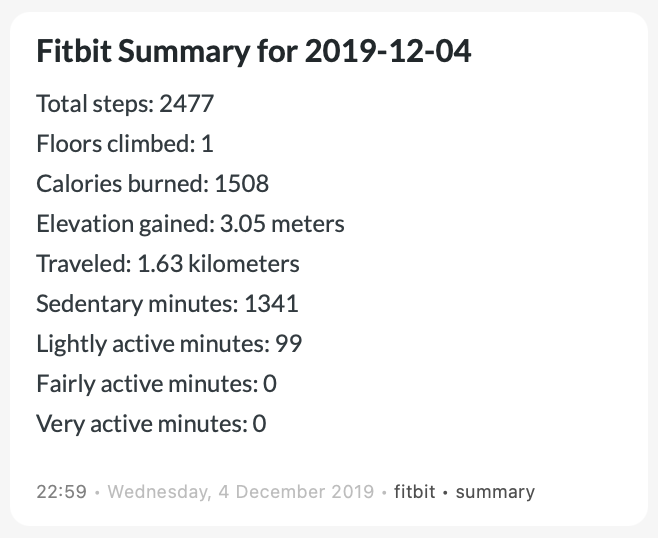

# Fitbit summary -> DayOne

After getting your [daily summary](https://dev.fitbit.com/build/reference/web-api/activity/get-daily-activity-summary/) through the Fitbit API, use this script to import the summary into DayOne.

It will use the date of the activity and create an entry with the summary.

Be sure to change (line 4)

 `timezone="Europe/Amsterdam"` 

to the timezone of your location.

